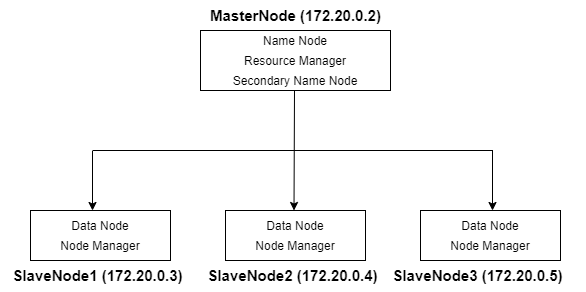

# hive-hadoop-docker
- This repo is for studying Hadoop and Hive architecture
- build master-slave architecture with multiple containers on one EC2 instance
- run 4 containers with docker-compose


## Architecture 




## Requirements (one EC2 on AWS)
- AMI: RHEL ver.8 
- Instance Type: t2.large
- Storage: 10GB


## Build

```
$ bash setup.sh 
$ bash build_docker_images.sh 
$ docker-compose up -d 
```


## Start Hadoop 

```
$ docker exec -it $(docker container ls | grep master | awk '{print $1}') bash 

[root] $ hdfs namenode -format
[root] $ bash /opt/hadoop/sbin/start-all.sh 
```